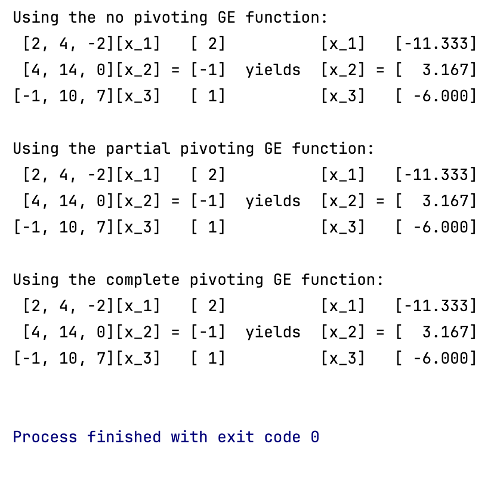
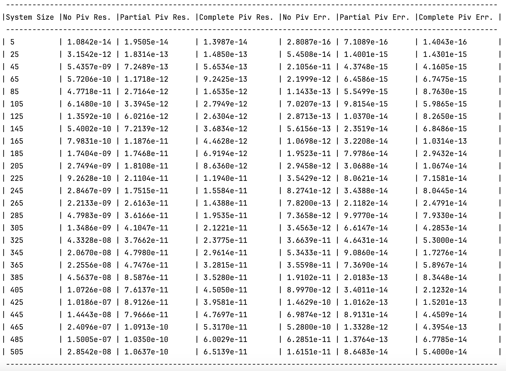
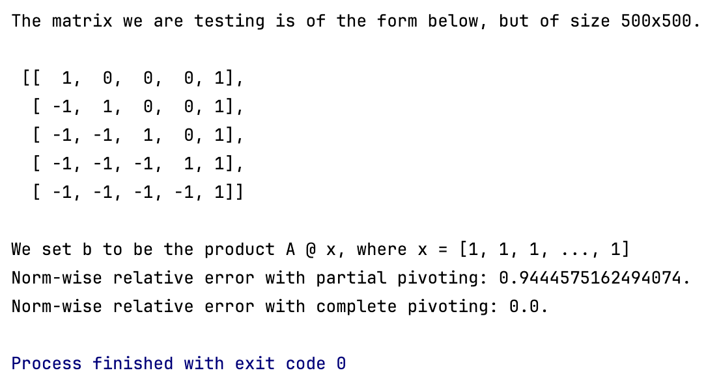

# Exploring the effects of pivoting on the accuracy of Gaussian Elimination

**Note:** It is very important to note that no one should ever use this code
within their programs to solve systems of linear equations (like ever, lol). It is extremely
inefficient. I implemented the main algorithms with just basic nested lists to mimic
how we could perform these computations by hand and make each step of the algorithms explicit.
For practical purposes, you should really always use linear system solvers from NumPy or SciPy. Here, I only used
NumPy when computing the residual vectors, relative errors, and any norms.

### GE Algorithms
We are exploring 3 types of Gaussian Elimination.
- **No Pivoting:** gaussian_elimination_no_pivoting.py
- **Partial (row) Pivoting:** gaussian_elimination_partial_pivoting.py
- **Complete (row and column) Pivoting:** gaussian_elimination_complete_pivoting.py

Additionally, the script all_gaussian_elimination_algorithms.py contains all 3 algorithms.

### Running all_gaussian_elimination_algorithms.py
You can modify the toy example to compute a different test system. With the current
setting, running this code produces the following output:

Computing the system by hand, gives (x_1, x_2, x_3) = (-34/3, 19/6, -6), so all the 
algorithms are accurate with a precision of 4 digits.

### Comparing Accuracy
Running **accuracy_comparisons.py** produces output similar to the following image. We are
producing random systems so results will vary every time, but the overall trends should remain. We generate
a random coefficient matrix A, and compute b (in the equation Ax = b) such that
x_i = (-1)^{i+1}.

We are computing the norms of the residual vectors and the norm-wise relative error of each
computed solution.

**Observations:**

For small systems (each system is nxn for some n), all the methods give nearly exact solutions.
As the system sizes increase, both partial and complete pivoting begin to significantly outperform
the no pivoting implementation in terms of accuracy (relative error) and residuals, by several decimal places.
Of course, this is to be expected. More interestingly, we see that while complete pivoting generally
has the lowest errors and residuals, the difference with partial pivoting is marginal. 

In fact, there are even a couple of cases (e.g. n = 325) where the error is very slightly larger for complete pivoting.
This indicates that for the random system produced at n = 325, the numerical stability of the algorithms
is so similar that the complete algorithm accumulated more error purely based on the different roundoffs from its
varying multipliers. This is not the general case, but is a good highlight of the similarity in performance
between partial and complete pivoting for most systems in floating point arithmetic.

Hence, in most cases, the theoretical slight increase in numerical stability offered by complete pivoting 
over its partial counterpart likely doesn't justify the increase in operation cost (2D search for the pivot
vs. 1D search). For practical purposes partial pivoting is probably the best option, offering a balance
between computational complexity and accuracy.

### Breaking Partial Pivoting
The above analysis will almost always hold true, but there are still cases when we would want to
use complete pivoting over partial pivoting. **breaking_partial_pivoting.py** produces a nonrandom matrix
where complete pivoting is significantly more accurate. Running the program, we see:

We see that for this specific system, partial pivoting computes a solution with a very large
relative error of approximately 0.94, indicating almost no accuracy at all. Complete pivoting
demonstrates perfect accuracy with no error, and successfully computes the exact solution. Increasing
the size of n increases the error in the partial pivoting solution. Playing around with the matrix by hand,
we can observe the rightmost column will accrue huge values in the bottom right corner after each row operation
(elimination) providing a massive pivot at every step of the elimination process, exactly what we want to avoid
errors when dealing with floating point arithmetic.